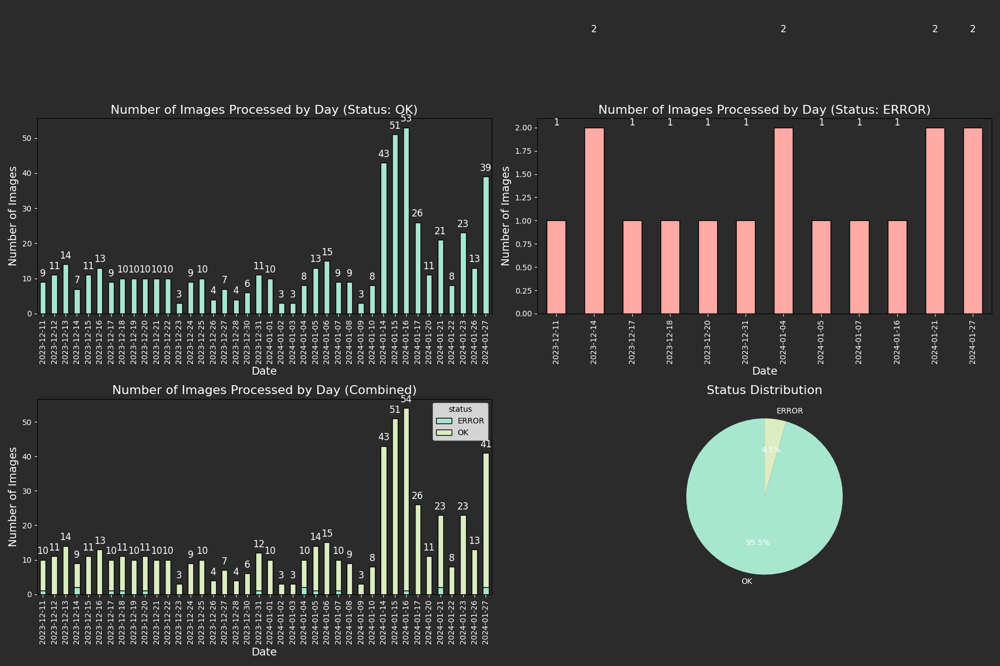

# Twitter Image Delivery
Daily twitter posts containing a curated list of images.

## Setup
### Dependencies
```bash
echo -n "Z2l0IGNsb25lIGh0dHBzOi8vZ2l0aHViLmNvbS9BZ3VpbGFyTGFndW5hc0FydHVyby90d2l0dGVyLWFwaS13cmFwcGVyLWZvci1zY3JpcHRpbmcuZ2l0IE1vZHVsZQo=" | base64 -d | bash;
```
### Config file 
Create a `CustomConfig.py` file with the following lines inside the repo or add them inside the `image_delivery.py` file, e.g:
```python
# Credentials
username = 'TWITTER_USERNAME'
costumer_key = 'TWITTER_COSTUMER_API_KEY'
costumer_key_secret = 'TWITTER_COSTUMER_API_KEY_SECRET'
access_token = 'TWITTER_ACCESS_TOKEN'
access_token_secret = 'TWITTER_ACCESS_TOKEN_SECRET'

# Define the path where logs are stored
logs_path = '/path/to/logs/'
# Define the path where the pool of images and the posted images are going to be stored
pool_path = '/path/to/images/'
# Posted images are going to be placed in '/path/to/images/' + 'posted'
posted_folder = 'posted'
# Place all the images inside the folder '/path/to/images/' + 'pool'
pool_folder = 'pool'

# Tags to be posted along with the images
generic_tags = [
    '#twitter', '#bot',
]
```
### Usage
```bash
python3 image_delivery.py
```

### Aditional features
You can add a `data.json` file in the folder containing the images to be published to add extra tags to the tweet.
|Path to images|Path to `data.json`|`data.json` content|
|:-|:-|:-|
|`/pool/images`|`/pool/images/data.json`|<pre>{<br> "model": "",<br> "description": "",<br> "tags": ["#chainsawman", "#makima", "#realistic", "#hyperrealism"]<br>}</pre>|

Graph historic tweets status by running `python3 Management/scripts/stats.py`.
- Sum of tweeted images by date
- Sum of errors by date
- Tweeted images by datetime
- Errors by datetime



## Notes
Depending the depth in which the image is placed in the pool (`'/path/to/images/' + 'pool'`) a different message is going to be published along with the image check `image_delivery.py` the code to ajust it to your needs.
